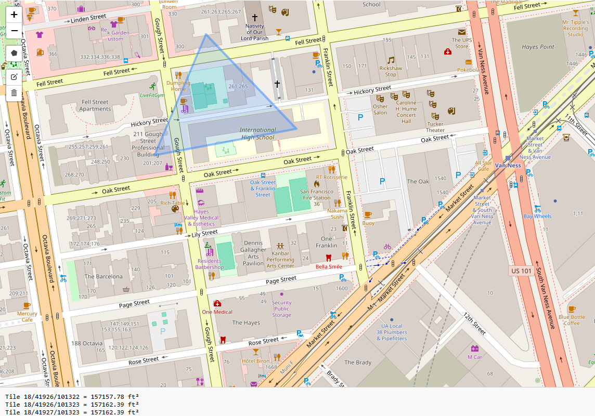

# Leaflet + Turf.js Tile Area Calculator

This project uses **Leaflet.js** and **Turf.js** to calculate the square feet area of map tiles (at zoom level 18) that intersect with a user-drawn polygon on a map.

## 📸 Output Preview

## ✨ Features

- Draw polygons using Leaflet Draw.
- Detects all intersecting tiles at zoom level 18.
- Calculates and displays area in square feet for each tile using Turf.js.
- Logs the result to the browser console in this format:

